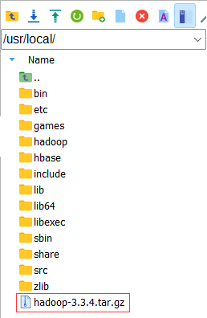
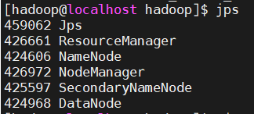
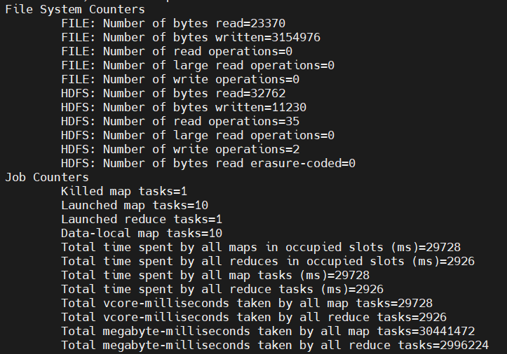
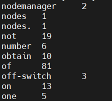

# Hadoop伪分布式部署指南

## 环境

- **操作系统**：OpenEuler 24.03 LTS 版本
- **硬件配置**：TaiShan 200 (Model 2280) (VD)服务器
- **工具**：MobaXterm

## 配置信息

- Openjdk1.8.0
- Hadoop3.3.4

## 目录

1. [创建hadoop用户](#创建hadoop用户)
2. [设置SSH免密登录](#设置ssh免密登录)
3. [安装并配置Openjdk](#安装并配置openjdk)
4. [下载并解压Hadoop](#下载并解压hadoop)
5. [修改Hadoop配置文件](#修改hadoop配置文件)
6. [启动Hadoop](#启动hadoop)
7. [测试Hadoop](#测试hadoop)

## 创建hadoop用户

- 利用MobaXterm以root用户登录服务器，输入如下命令创建hadoop用户 (推荐命名为"hadoop",以免不必要的报错)

    ```bash
    sudo adduser hadoop
    ```

- 为hadoop用户设置密码

    ```bash
    sudo passwd hadoop
    ```

- 系统会提示你输入并确认新用户的密码

- 将hadoop用户添加到 wheel 组,赋予sudo的权限

    ```bash
    sudo usermod -aG wheel hadoop
    ```

## 设置SSH免密登录

- 以下所有操作都将在用户hadoop下执行

    ```bash
    # 切换至hadoop用户
    su hadoop
    ```

- 输入生成SSH私钥与公钥的命令，输入hadoop用户密码。这一步会提醒设置SSH密码，输入密码时直接回车就表示无密码，第二次输入密码回车确定

    ```bash
    # 进入.ssh目录
    cd ~/.ssh/
    # 生成SSH私钥与公钥
    ssh-keygen -t rsa
    ```

- 将生成的SSH的公钥加入目标机器的SSH目录下

    ```bash
    cat ./id_rsa.pub >> ./authorized_keys
    ```

- 验证SSH已配置免密登陆

    ```bash
    ssh localhost
    ```

- 若这时无需输入密码，则表示免密配置成功。

## 安装并配置Openjdk

- 通过yum命令安装Openjdk

    ```bash
    sudo yum install -y java-1.8.0-openjdk-devel java-1.8.0-openjdk
    ```

- 输入如下命令查看Openjdk的安装路径

    ```bash
    readlink -f $(which java)
    ```

- 例如，本环境中的Openjdk安装路径为：

    ```bash
    /usr/lib/jvm/java-1.8.0-openjdk-1.8.0.412.b08-5.oe2403.aarch64/bin/java
    ```

- 打开~/.bashrc文件

    ```bash
    sudo vim ~/.bashrc
    ```

- 按下i键进入编辑模式，在文件行尾添加如下内容：

    ```bash
    # 取bin文件夹的父目录作为JAVA_HOME
    export JAVA_HOME=/usr/lib/jvm/java-1.8.0-openjdk-1.8.0.412.b08-5.oe2403.aarch64
    export PATH=$JAVA_HOME/bin:$PATH
    ```

- 按ESC键退出编辑模式，输入:wq保存退出,输入命令更新环境变量

    ```bash
    source ~/.bashrc
    ```

## 下载并解压Hadoop

- 从[官方网站](https://archive.apache.org/dist/hadoop/common/)找到hadoop-3.3.4.tar.gz，下载到本地
- 将下载的hadoop-3.3.4.tar.gz文件拖入MobaXTerm左侧的文件目录，等待上传完毕，本环境拖入到/usr/local/目录下

    
- 进入/usr/local/目录，执行如下命令解压hadoop-3.3.4.tar.gz文件

    ```bash
    # 进入/usr/local/目录
    cd /usr/local/
    # 解压hadoop-3.3.4.tar.gz文件到/usr/local/目录下
    sudo tar -zxvf hadoop-3.3.4.tar.gz
    ```

- 将解压后的hadoop-3.3.4文件夹重命名为hadoop

    ```bash
    sudo mv hadoop-3.3.4 hadoop
    ```

- 将hadoop文件夹的拥有者指定给hadoop用户

    ```bash
    sudo chown -R hadoop ./hadoop
    ```

- 打开~/.bashrc文件

    ```bash
    sudo vim ~/.bashrc
    ```

- 按下i键进入编辑模式，在文件末尾添加以下内容

    ```bash
    export HADOOP_HOME=/usr/local/hadoop
    export HADOOP_COMMON_HOME=$HADOOP_HOME
    export HADOOP_CONF_DIR=$HADOOP_HOME/etc/hadoop
    export HADOOP_HDFS_HOME=$HADOOP_HOME
    export YARN_HOME=$HADOOP_HOME
    export HADOOP_MAPRED_HOME=$HADOOP_HOME
    export PATH=$PATH:$HADOOP_HOME/bin:$HADOOP_HOME/sbin
    ```

- 按ESC键退出编辑模式，输入:wq保存退出并更新环境变量

    ```bash
    source ~/.bashrc
    ```

- 配置hadoop-env.sh文件

    ```bash
    # 进入/usr/local/hadoop/etc/hadoop目录
    cd /usr/local/hadoop/etc/hadoop
    # 使用vim编辑器打开hadoop-env.sh文件
    sudo vim hadoop-env.sh
    ```

- 按i键进入编辑模式，添加JAVA_HOME环境变量

    ```bash
    export JAVA_HOME=/usr/lib/jvm/java-1.8.0-openjdk-1.8.0.412.b08-5.oe2403.aarch64
    ```

- 按Esc键退出，然后输入:wq保存修改。然后使环境变量生效

    ```bash
    source hadoop-env.sh
    ```

- 截至目前，hadoop框架已经搭建好了，可以通过调用版本号测试hadoop是否可用

    ```bash
    # 进入hadoop目录
    cd /usr/local/hadoop
    # 测试hadoop是否可用
    ./bin/hadoop version
    ```

- 如果出现正确的版本号，则表示hadoop安装成功。

## 修改Hadoop配置文件

- 进入/usr/local/hadoop/etc/hadoop目录下

    ```bash
    cd /usr/local/hadoop/etc/hadoop
    ```

- 打开core-site.xml文件

    ```bash
    sudo vim core-site.xml
    ```

- 修改core-site.xml文件为如下配置

    ```xml
    <configuration>
        <!-- 配置NameNode的主机名和端口号 -->
        <property>
            <name>fs.defaultFS</name>
            <value>hdfs://localhost:9000</value>
            <!-- 使用localhost表示在本地运行伪分布式，9000为默认端口号 -->
        </property>

        <!-- 其它临时目录的父目录，会被其它临时目录用到 -->
        <property>
            <name>hadoop.tmp.dir</name>
            <value>file:/usr/local/hadoop/tmp</value>
            <description>A base for other temporary directories.</description>
        </property>
    </configuration>
    ```

- 保存并且退出core-site.xml文件
- 确保当前路径还是/usr/local/hadoop/etc/hadoop，打开hdfs-site.xml文件

    ```bash
    # 打开hdfs-site.xml文件
    sudo vim hdfs-site.xml
    ```

- 修改hdfs-site.xml文件为如下配置

    ```xml
    <configuration>
        <!-- 设置HDFS文件副本数 -->
        <property>
            <name>dfs.replication</name>
            <value>1</value>
        </property>

        <!-- 设置HDFS元数据文件存放路径 -->
        <property>
            <name>dfs.namenode.name.dir</name>
            <value>file:/usr/local/hadoop/tmp/dfs/name</value>
        </property>

        <!-- 设置HDFS数据文件存放路径 -->
        <property>
            <name>dfs.datanode.data.dir</name>
            <value>file:/usr/local/hadoop/tmp/dfs/data</value>
        </property>

        <!-- NameNode webUI监听的地址和端口 -->
        <property>
            <name>dfs.namenode.http-address</name>
            <value>0.0.0.0:50070</value>
        </property>

        <!-- Secondary NameNode webUI监听的地址和端口 -->
        <property>
            <name>dfs.namenode.secondary.http-address</name>
            <value>0.0.0.0:50090</value>
        </property>

        <!-- 是否允许在NameNode和DataNode中启用WebHDFS (REST API) -->
        <property>
            <name>dfs.webhdfs.enabled</name>
            <value>true</value>
        </property>

        <!-- Client连接DataNode时，是否应该使用DataNode的主机名 -->
        <property>
            <name>dfs.client.use.datanode.hostname</name>
            <value>true</value>
        </property>

        <!-- 设置其他用户操作时会提醒没有权限 -->
        <property>
            <name>dfs.permissions</name>
            <value>false</value>
        </property>
    </configuration>
    ```

- 保存并退出hdfs-site.xml文件

- 确保当前路径还是/usr/local/hadoop/etc/hadoop，打开mapred-site.xml文件

    ```bash
    sudo vim mapred-site.xml
    ```

- 修改mapred-site.xml文件为如下配置

    ```xml
    <configuration>
            <property>
                    <name>mapreduce.framework.name</name>
                    <value>yarn</value>
            </property>
    </configuration>
    ```

- 保存并退出mapred-site.xml文件

- 在命令行输入如下命令，并将返回的地址复制

    ```bash
    hadoop classpath
    ```

- 打开yarn-site.xml文件

    ```bash
    sudo vim yarn-site.xml
    ```

- 修改yarn-site.xml文件为如下配置

    ```xml
    <configuration>
    <!-- Site specific YARN configuration properties -->
        <property>
            <name>yarn.nodemanager.aux-services</name>
            <value>mapreduce_shuffle</value>
        </property>
        <property>
            <name>yarn.application.classpath</name>
            <value>
            输入上一步得到得值
            </value>
        </property>
    </configuration>
    ```

- 保存并退出yarn-site.xml文件

## 启动Hadoop

- 格式化HDFS

    ```bash
    /usr/local/hadoop/bin/hdfs namenode -format
    ```

- 启动全部进程

    ```bash
    start-all.sh
    ```

- 输入jps查看进程

    ```bash
    jps
    ```

- 若看到有如下六个进程，则证明Hadoop启动成功

    

## 测试Hadoop

- 在HDFS中创建用户目录

    ```bash
    hdfs dfs -mkdir -p /user/hadoop
    ```

- 创建input目录，用于输入数据

    ```bash
    hdfs dfs -mkdir input
    ```

- 将所需的xml配置文件复制到input中

    ```bash
    hdfs dfs -put /usr/local/hadoop/etc/hadoop/*.xml input
    ```

- 如果系统之前运行过hadoop，则需要删除output目录

    ```bash
    hdfs dfs -rm -r output
    ```

- 测试示例，进入hadoop目录，执行

    ```bash
    # 进入hadoop目录
    cd /usr/local/hadoop
    # 执行
    hadoop jar ./share/hadoop/mapreduce/hadoop-mapreduce-examples-*.jar wordcount input output
    ```

- 等待片刻后出现如下信息

    
- 进入hadoop下面的bin

    ```bash
    cd /usr/local/hadoop/bin
    ```

- 查看运行结果

    ```bash
    hdfs dfs -cat output/*
    ```

- 部分结果如下图：

    

### 至此，Hadoop环境搭建完成
