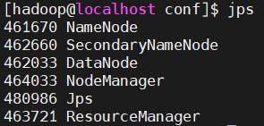
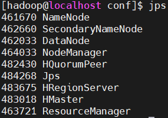
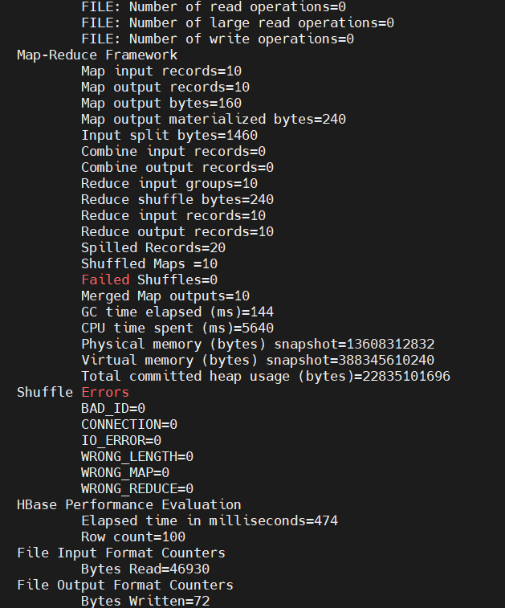

# HBase伪分布式部署指南

## 环境

- **操作系统**：OpenEuler24.03LTS版本
- **硬件配置**：TaiShan 200 (Model 2280) (VD)服务器
- **软件配置**：Openjdk1.8.0,Hadoop3.3.4
- **工具**：MobaXterm

## 配置信息

- HBase2.5.7

## 前言

- 确保你已经按照“Hadoop伪分布式部署指南”在hadoop用户下部署了JDK1.8.0和Hadoop3.3.4

## 目录

- [下载HBase并解压](#下载hbase并解压)
- [配置HBase](#配置hbase)
- [启动HBase](#启动hbase)
- [使用PE工具测试HBase](#使用pe工具测试hbase)

## 下载HBase并解压

- 从[官方网站](https://archive.apache.org/dist/hbase/)找到并下载hbase2.5.7-bin.tar.gz
- 将下载的hbase2.5.7-bin.tar.gz文件拖入MobaXTerm左侧的文件目录，等待上传完毕，本环境拖入到/usr/local/目录下
- 切换到hadoop用户

    ```bash
    su hadoop
    ```

- 进入/usr/local/目录，执行如下命令解压hbase2.5.7-bin.tar.gz文件

    ```bash
    # 进入/usr/local/目录
    cd /usr/local/
    # 解压hbase2.5.7-bin.tar.gz文件
    sudo tar -zxvf hbase2.5.7-bin.tar.gz
    ```

- 修改hbase-2.5.7文件名为hbase

    ```bash
    sudo mv hbase-2.5.7 hbase
    ```

- 将hbase文件夹的拥有者指定给hadoop用户

    ```bash
    sudo chown -R hadoop ./hbase
    ```

- 配置HBase环境变量

    ```bash
    # 打开~/.bashrc文件
    sudo vim ~/.bashrc
    ```

- 在~/.bashrc文件中添加如下内容

    ```bash
    export HBASE_HOME=/usr/local/hbase
    export PATH=$PATH:$HBASE_HOME/bin
    ```

- 更新环境变量

    ```bash
    source ~/.bashrc
    ```

## 配置HBase

- 进入hbase的conf目录，修改配置文件hbase-env.sh

    ```bash
    # 进入hbase的conf目录
    cd /usr/local/hbase/conf
    # 修改配置文件hbase-env.sh
    sudo vim hbase-env.sh
    ```

- 在hbase-env.sh文件中添加如下内容

    ```bash
    # 添加你的JAVA_HOME路径
    export JAVA_HOME=/usr/lib/jvm/java-1.8.0-openjdk-1.8.0.412.b08-5.oe2403.aarch64
    export HBASE_DISABLE_HADOOP_CLASSPATH_LOOKUP=true
    ```

- 修改配置文件hbase-site.xml

    ```bash
    # 进入hbase的conf目录
    cd /usr/local/hbase/conf
    # 编辑hbase-site.xml文件
    sudo vim hbase-site.xml
    ```

- 修改hbase-site.xml为如下配置

    ```xml
    <configuration>
    <!-- 设置HBase为分布式模式 -->
    <property>
        <name>hbase.cluster.distributed</name>
        <value>true</value>
    </property>

    <!-- 设置HBase根目录 -->
    <property>
        <name>hbase.rootdir</name>
        <value>hdfs://localhost:9000/hbase</value>
    </property>

    <!-- 设置Zookeeper数据目录 -->
    <property>
        <name>hbase.zookeeper.property.dataDir</name>
        <value>/usr/local/hbase/zookeeper</value>
    </property>

    <!-- 安全性设置 -->
    <property>
        <name>hbase.unsafe.stream.capability.enforce</name>
        <value>true</value>
    </property>

    <!-- 配置Zookeeper集群主机列表（单节点伪分布式配置中可以使用localhost） -->
    <property>
        <name>hbase.zookeeper.quorum</name>
        <value>localhost</value>
    </property>
    </configuration>
    ```

- 保存并退出hbase-site.xml文件

## 启动HBase

- 输入命令jps，确保Hadoop集群已经启动

    ```bash
    jps
    ```

- 若出现以下进程，则证明Hadoop集群已经启动

    

- 启动HBase

    ```bash
    start-hbase.sh
    ```

- 输入命令jps，确保HBase已经启动

    ```bash
    jps
    ```

- 若出现以下进程，则证明HBase已经启动

    

## 使用PE工具测试HBase

- 输入如下命令测试HBase

    ```bash
    hbase pe --rows=10 increment 10
    ```

- 出现如下结果，则证明HBase可以正常运行

    

### 至此，HBase伪分布式部署完成
