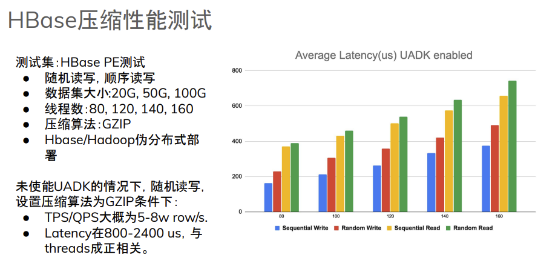
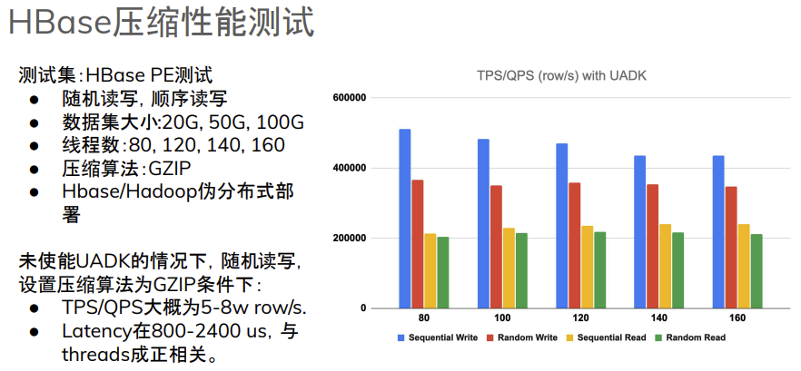

# 使用UADK加速Hbase GZIP压缩
## 概述
HBase的写入顺序为先写入memstore，再刷入HDFS，即后端存储。为了降低从memstore flush到磁盘的数据大小，在Flush过程中，
通常会针对storeFile进行压缩，支持LZ4，SNAPPY，BZIP2，GZIP等压缩算法。

HBase GZ压缩的配置方法：
- HBase建表时指定
- HBase PE测试也可以对压缩算法进行测试
- GZ压缩依赖于HadoopNativeLibrary中对Zlib的支持

本次测试中，为了尽可能减少对应用的侵入式改动，我们通过zlib-uadk项目提供的wrap机制，替换hadoop native zlib library，
无缝兼容zlib生态，对Hadoop，HBase应用无感知。

## UADK和zlib-uadk库编译和配置
### UADK配置使能
环境：openEuler 24.03 LTS

硬件：Kunpeng 920

参考文档[UADK](https://gitee.com/openeuler/uadk-bigdata/blob/master/uadk.md)完成UADK在kunpeng920上的配置和使能。

### zlib-uadk库编译和配置
地址：https://github.com/kevinzs2048/zlib-uadk/tree/cfg1234-patch-2

```
g++ -shared -fPIC -O3  -I/usr/local/include/uadk -L/usr/local/lib -lwd -lwd_comp -lnuma -lhisi_zip -o libzuadk.so zlib_uadk.cc
```
如何enable使用zlib UADK:
```
Symbol links(libz.so和libz.so.1) must be created for library file libzuadk.so and move to a directory different with system zlib library path(/usr/local/lib is recommended).

How to use UADK zlib library:
execute command as follow:
LD_LIBRARY_PATH=/usr/local/lib:$LD_LIBRARY_PATH ./your_command
```

编译完成后，通过uadk_test代码检测其是否可工作：
```
# Build uadk_test
gcc -fPIC -O3 -lz -o uadk_test uadk_test.c

# Use the software zlib execute compress without enable UADK
./uadk_test 20 65536 5 5 /root/hadoop-3.3.4.tar.gz

# Use UADK to execute the zlib compress
LD_LIBRARY_PATH=/usr/local/lib:$LD_LIBRARY_PATH  ./uadk_test 20 65536 5 5 /root/hadoop-3.3.4.tar.gz

# check the number change after the above command to confirm the UADK Zip engine is used.
cat /sys/kernel/debug/hisi_zip/*/qm/regs | grep QM_DFX_DB_CNT
```
到此，我们完成了uadk-zlib库的配置，接下来进行Hadoop和HBase的环境搭建。

## Hadoop和HBase的环境搭建
为了测试简便，我们依然采用伪分布式集群部署模式。 Hadoop部署，请参考文档[Hadoop伪分布式部署指南](./BuildHadoopEnvironment.md). 
在[Hadoop伪分布式部署指南](./BuildHadoopEnvironment.md)基础上，修改core-site.yml，请添加：
```
    <property>
       <name>io.compression.codecs</name>
       <value>org.apache.hadoop.io.compress.GzipCodec,
              org.apache.hadoop.io.compress.DefaultCodec,
              org.apache.hadoop.io.compress.BZip2Codec
           </value>
   </property>
```

修改`hadoop-env.sh`, 执行Hadoop native library.
```
export HADOOP_OPTS="-Djava.library.path=${HADOOP_HOME}/lib/native/"
```

部署Hadoop执行start-all.sh脚本之前，需要配置Hadoop使用native library zlib。具体方式如下：
```
# 将上面编译出来的libzuadk.so拷贝到/usr/local/hadoop/lib/native/
# 并在该目录下创建软链接libz.so.1，最终效果如下：
[hadoop@hadoop1 hadoop]$ ls -la /usr/local/hadoop/lib/native/libz.so.1
lrwxrwxrwx 1 hadoop hadoop 11 Nov 12 17:42 /usr/local/hadoop/lib/native/libz.so.1 -> libzuadk.so
```
执行start-all.sh, 部署Hadoop。

Hadoop部署完成后，运行hadoop checknative,得到下面输出，可以看到zlib的运行库指向了hadoop native。在后续的Hbase 写入过程中，使能GZ压缩，
也会同样调用Hadoop native library zlib进行压缩解压缩。因此该步骤确认调用关系非常关键。
```
[hadoop@hadoop1 hadoop]$ hadoop checknative
2024-12-25 18:31:42,752 INFO bzip2.Bzip2Factory: Successfully loaded & initialized native-bzip2 library system-native
2024-12-25 18:31:42,757 INFO zlib.ZlibFactory: Successfully loaded & initialized native-zlib library
2024-12-25 18:31:42,762 WARN erasurecode.ErasureCodeNative: ISA-L support is not available in your platform... using builtin-java codec where applicable
2024-12-25 18:31:42,794 INFO nativeio.NativeIO: The native code was built without PMDK support.
Native library checking:
hadoop:  true /usr/local/hadoop/lib/native/libhadoop.so.1.0.0
zlib:    true /usr/local/hadoop/lib/native/libz.so.1
zstd  :  true /usr/lib64/libzstd.so.1
bzip2:   true /usr/lib64/libbz2.so.1
openssl: false EVP_CIPHER_CTX_block_size
ISA-L:   false libhadoop was built without ISA-L support
PMDK:    false The native code was built without PMDK support.
```

### HBase 部署
#### 部署三副本Zookeeper
部署三副本ZK的主要目的是增加可以连接的instance，避免在后续进行测试时出现ZK client connection不足的情况
```
mkdir /usr/local/zookeeper-cluster/
tar -zxf zookeeper-3.4.14.tar.gz -C /usr/local/zookeeper-cluster/zookeeper-1/
cp -rf /usr/local/zookeeper-cluster/zookeeper-1 /usr/local/zookeeper-cluster/zookeeper-2
cp -rf /usr/local/zookeeper-cluster/zookeeper-1 /usr/local/zookeeper-cluster/zookeeper-3
```
配置zookeeper-1, zookeeper-2和zookeeper-3的conf。以zookeeper-1为例，/usr/local/zookeeper-cluster/zookeeper-1/conf/zoo.cfg
```

# The number of milliseconds of each tick
tickTime=2000
# The number of ticks that the initial
# synchronization phase can take
initLimit=10
# The number of ticks that can pass between
# sending a request and getting an acknowledgement
syncLimit=5
# the directory where the snapshot is stored.
# do not use /tmp for storage, /tmp here is just
# example sakes.
dataDir=/usr/local/zookeeper-cluster/zookeeper-1/data
dataLogDir=/usr/local/zookeeper-cluster/zookeeper-1/log
# the port at which the clients will connect
clientPort=2181
server.1=192.168.90.35:2881:3881
server.2=192.168.90.35:2882:3882
server.3=192.168.90.35:2883:3883

# the maximum number of client connections.
# increase this if you need to handle more clients
#maxClientCnxns=120
#
# Be sure to read the maintenance section of the
# administrator guide before turning on autopurge.
#
# http://zookeeper.apache.org/doc/current/zookeeperAdmin.html#sc_maintenance
#
# The number of snapshots to retain in dataDir
#autopurge.snapRetainCount=3
# Purge task interval in hours
# Set to "0" to disable auto purge feature
#autopurge.purgeInterval=1
```
zookeeper-2 和zookeeper-3，分别修改dataDir, dataLogDir和ClientPort即可。

配置完成后执行：
```
/usr/local/zookeeper-cluster/zookeeper-1/bin/zkServer.sh start
/usr/local/zookeeper-cluster/zookeeper-2/bin/zkServer.sh start
/usr/local/zookeeper-cluster/zookeeper-3/bin/zkServer.sh start
```
通过下面命令检查zookeeper伪分布式是否部署完成，如下QuorumPeerMain有三个，对应于ZK的三个节点。
注意如果有hadoop部署，jps进程会增加很多hadoop输出，但QuorumPeerMain为三个不受影响。
```
[hadoop@hadoop1 zookeeper-cluster]$ jps
2964107 QuorumPeerMain
2964464 Jps
2963939 QuorumPeerMain
2964290 QuorumPeerMain
```

### HBase配置
参考[HBase部署文档](./BuildHbaseEnvironment.md),需要注意的是修改hbase-site.yml如下，主要修改为zookeeper的配置。
```

<configuration>
<property>
    <name>hbase.cluster.distributed</name>
    <value>true</value>
</property>

<property>
    <name>hbase.rootdir</name>
    <value>hdfs://hadoop1:9000/hbase</value>
</property>

<property>
        <name>hbase.zookeeper.quorum</name>
        <value>hadoop1:2181, hadoop1:2182, hadoop1:2183</value>
    </property>

<property>
    <name>hbase.unsafe.stream.capability.enforce</name>
    <value>true</value>
</property>
<property>
  <name>hbase.table.sanity.checks</name>
  <value>false</value>
</property>
</configuration>

```
修改完成后，参考[HBase部署文档](./BuildHbaseEnvironment.md)，启动Hbase.

## Hbase压缩测试
```asm
cd script
python3 main.py
```
测试结果记录在openEuler Summit 2024的技术分享[slides](./slides/openEuler-uadk-bigdata.pdf) openEuler上使用UADK
加速大数据应用的最佳实践中，具体结论及内容如下：


