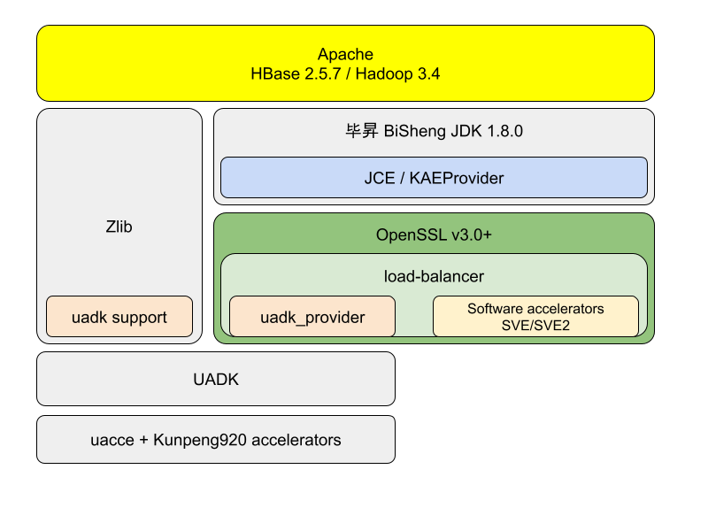

# BigData + UADK: A full-stack solution to accelerate big data processing

#### Background
Modern computing environments offer a variety of hardware acceleration  features, such as encryption and compression, to improve performance and efficiency. UADK is a unified user-mode programming interface suite,  designed based on Shared Virtual Addresses (SVA) technology, designed to make these hardware acceleration functions easy to use. However, in a  big data environment, it is not easy to take full advantage of these  hardware acceleration features, which requires close collaboration  between hardware and software. 

### Project Introduction

This project aims to build a full-stack acceleration solution from hardware  to application layer, especially in the field of big data. Our goal is  to integrate the capabilities of the UADK with OpenSSL 3.0 and  efficiently export these capabilities to a big data software stack that  typically relies on the Java Development Kit (JDK) to ensure high  performance, stability, and cross-platform compatibility. The core of  this project is to establish an effective path to connect the JDK with  OpenSSL 3.0 to provide a complete hardware acceleration solution for big data applications. 

### Software architecture

We built a full-stack solution, as shown in the diagram below. From top to bottom, HBase (for big data storage and processing), JDK (for  cross-platform support and performance optimization), OpenSSL (for  security and encryption), UADK (for hardware acceleration), Linux kernel drivers (for hardware communication), and hardware accelerators at the  bottom. 

### The main innovations

1. Dynamic scheduling mechanism: We have implemented a dynamic scheduling  mechanism in OpenSSL 3.0 called load-balancing. It allows multiple  implementations of the same algorithm and the ability to dynamically  deploy computational tasks to the most appropriate hardware unit based  on the load state of the system.
2. Efficient Symmetric Encryption Algorithm: We chose SM4 as the symmetric  encryption algorithm in the project and integrated it into HDFS  Transparent Encryption. The purpose of this is to verify the performance of SM4 in big data scenarios, especially after acceleration by multiple computing power units.

Through these innovations, we expect to dramatically improve the efficiency and performance of big data processing while ensuring data security. 

#### The installation tutorial is explained in detail

This tutorial describes how to build a BigData + UADK solution in an openEuler environment. Follow these steps: 

1. **Prepare the openEuler environment**
   - Make sure your system is openEuler 23.09, which provides good underlying support for hardware acceleration. 
   - Update the system package and install the necessary dependencies to ensure  that the system runs stably and is compatible with subsequent  installation steps. 
2. **UADK project code pulling, compiling, installing**
   - Pull the UADK project code from the official repository. 
   - Set the necessary compilation environment and parameters according to the project documentation. 
   - Compile the UADK source code and install the compiled product according to the guidance document. 
3. **OpenSSL 3.0 and OpenSSL providers (uadk_provider) installed**
   - Download and install OpenSSL 3.0 and make sure you have a UADK-compatible version installed. 
   - Install uadk_provider, which is an OpenSSL hardware acceleration provider that is tightly integrated with UADK. 
   - Configure OpenSSL to make sure it recognizes and uses uadk_provider correctly. 
4. **Bisheng JDK 8.0 installation and configuration**
   - Download and install Ascension JDK 8.0, a version of the JDK tailored for performance optimization. 
   - Configure environment variables to ensure that systems and applications can find and use the BethenJDK. 
5. **HDFS/Hadoop installation, HBase installation**
   - Install Hadoop and ensure that HDFS is running properly, which is the foundation for big data storage and processing.
   - Build HBase on the basis of Hadoop, which is a highly reliable and  high-performance distributed database suitable for big data scenarios.
6. **Joint debugging, testing**
   - After the entire software stack is installed, joint debugging is performed to ensure that the components work together correctly.
   - Execute test cases to ensure that hardware acceleration is being utilized  correctly and that the overall performance of the system is as expected.
   - For any problems encountered, refer to the documentation for each component for debugging, and record the resolution process and results.

By following the preceding steps, you will be able to build a  high-performance big data processing platform in the openEuler  environment, take full advantage of the hardware acceleration function,  and improve data processing efficiency and system performance.

#### Description of the code structure

This project is a code integration project by integrating the existing ones. In order to facilitate the user's understanding, the configuration code is provided as a reference.

1. ./uadk
2. ./openssl
3. ./bisheng_jdk
4. ./hbase
5. ./pictures

#### How to contribute

1. Fork this repository
2. Create a new Feat_xxx branch
3. Submit the code
4. Create a new pull request
