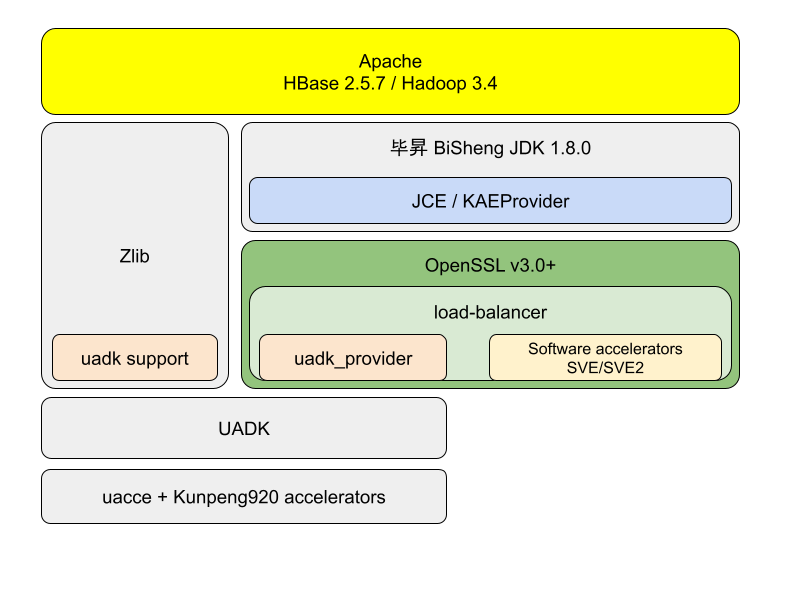

# BigData + UADK: 加速大数据处理的全栈解决方案

### 背景
现代计算环境提供了多种硬件加速功能，例如加密和压缩，以提高性能和效率。UADK是一个统一的用户态编程接口套件，基于SVA（Shared Virtual Addresses）技术设计，旨在使这些硬件加速功能易于使用。然而，在大数据环境中，要充分利用这些硬件加速功能并不容易，这需要软硬件之间的紧密协作。

### 项目介绍
本项目旨在构建一个从硬件到应用层的全栈加速解决方案，尤其是在大数据领域。我们的目标是整合UADK的能力和OpenSSL 3.0，并将这些能力高效地输出到大数据软件栈，该软件栈通常依赖于Java开发工具包（JDK）以确保高性能、稳定性和跨平台兼容性。本项目的核心是建立一个有效的通路，将JDK与OpenSSL 3.0连接起来，从而为大数据应用提供一个完整的硬件加速方案。

### 软件架构
我们构建了一个全栈的解决方案，如下图所示。从上至下依次是：HBase（用于大数据存储和处理）、JDK（提供跨平台支持和性能优化）、OpenSSL（提供安全和加密功能）、UADK（提供硬件加速功能）、Linux内核驱动（与硬件沟通的桥梁），以及最底层的硬件加速器。

### 主要创新点

1. **动态调度机制**：我们在OpenSSL 3.0中实现了一种动态调度机制，称为load-balancing。它允许相同的算法有多个实现，并能够根据系统的负载状态，动态地将计算任务部署到最适合的硬件单元上。

2. **高效对称加密算法**：我们选择SM4作为项目中的对称加密算法，并将其集成到HDFS Transparent Encryption中。这样做的目的是在大数据场景中验证SM4的性能，特别是在通过多算力单元加速后的使用性能。

通过这些创新，我们期望大幅提高大数据处理的效率和性能，同时保证数据的安全性。

#### 安装教程详解

本教程旨在指导用户如何在openEuler环境中搭建整个BigData + UADK解决方案。请按照以下步骤进行操作：

1. **openEuler 环境准备**
   - 确保您的系统是openEuler 23.09，它为硬件加速提供了良好的底层支持。
   - 更新系统包并安装必要的依赖，以确保系统稳定运行并兼容后续的安装步骤。

2. **UADK 项目代码拉取，编译，安装**
   - 从官方仓库拉取UADK项目代码。
   - 根据项目文档说明，设置必要的编译环境和参数。
   - 编译UADK源代码，并根据指导文档安装编译后的产物。

3. **OpenSSL 3.0 及 OpenSSL providers （uadk_provider）安装**
   - 下载并安装OpenSSL 3.0，确保您安装的是与UADK兼容的版本。
   - 安装uadk_provider，这是与UADK紧密集成的OpenSSL硬件加速提供者。
   - 配置OpenSSL，确保它能够识别并正确使用uadk_provider。

4. **毕昇JDK 8.0 安装及配置**
   - 下载并安装毕昇JDK 8.0，这是一个为性能优化而定制的JDK版本。
   - 配置环境变量，确保系统和应用程序能够找到并使用毕昇JDK。

5. **HDFS/Hadoop 安装，HBase 搭建**
   - 安装Hadoop，并确保HDFS正常运行，它是大数据存储和处理的基础。
   - 在Hadoop基础上搭建HBase，这是一个高可靠性、高性能的分布式数据库，适用于大数据场景。

6. **联调，测试**
   - 在整个软件栈安装完毕后，进行联调，确保各组件间能够正确协同工作。
   - 执行测试案例，确保硬件加速功能被正确利用，并且系统的整体性能符合预期。
   - 对于遇到的任何问题，参考各组件的文档进行调试，并记录解决过程和结果。

通过遵循以上步骤，您将能够在openEuler环境中搭建起一个高性能的大数据处理平台，充分利用硬件加速功能，提高数据处理效率和系统性能。

#### 代码结构说明

本项目是一个代码集成项目，通过集成现有。为了方便用户理解，提供配置代码做为参考。

1.  ./uadk
2.  ./openssl
3.  ./bisheng_jdk
4.  ./hbase
5.  ./pictures

#### 如何参与贡献

1.  Fork 本仓库
2.  新建 Feat_xxx 分支
3.  提交代码
4.  新建 Pull Request