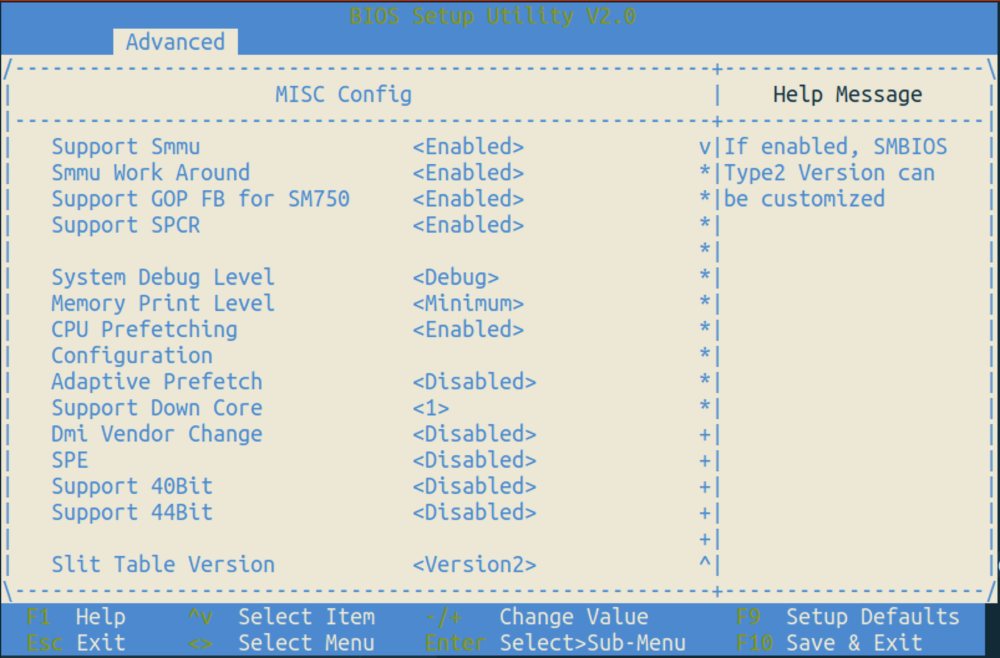

# 鲲鹏硬件加速器

首先确认服务器上的硬件加速器（Kunpeng hardware accelerator）开启，并且可用。

    sudo ls -lat /dev/hisi*

如果返回 `ls: cannot access '/dev/hisi*': No such file or directory`，则说明硬件加速器没有开启。

## 在 Bootloader 中开启

需要确认服务器拥有相应的加速器使用授权。具体方式请向服务器供应商咨询。
需要在 BIOS 中确认 SMMU 相关配置使能。包括：`Support Smmu` 和 `Smmu Work Around` 都需要 `Enable`。

## 内核启动参数 及 内核模块加载

需要增加这些启动参数到 Linux kernel 命令行 `hisi_zip.uacce_mode=1 hisi_sec2.uacce_mode=1 hisi_hpre.uacce_mode=1`

可通过如下命令查看当前系统的 Linxu kernel 命令行。

    $ cat /proc/cmdline

如果缺少上面所列的`uacce_mode`参数，请通过修改文件`grub.cfg`增加。

    # vim /boot/efi/EFI/openEuler/grub.cfg

这里给出一种修改，可以参考

    # diff grub.cfg grub.cfg.bak
    122c122
    <       linux   /vmlinuz-6.4.0-10.1.0.20.oe2309.aarch64 root=/dev/mapper/openeuler-root ro rd.lvm.lv=openeuler/root rd.lvm.lv=openeuler/swap video=VGA-1:640x480-32@60me cgroup_disable=files apparmor=0 crashkernel=1024M,high smmu.bypassdev=0x1000:0x17 smmu.bypassdev=0x1000:0x15 rhgb quiet console=tty0 hisi_zip.uacce_mode=1 hisi_sec2.uacce_mode=1 hisi_hpre.uacce_mode=1
    ---
    >       linux   /vmlinuz-6.4.0-10.1.0.20.oe2309.aarch64 root=/dev/mapper/openeuler-root ro rd.lvm.lv=openeuler/root rd.lvm.lv=openeuler/swap video=VGA-1:640x480-32@60me cgroup_disable=files apparmor=0 crashkernel=1024M,high smmu.bypassdev=0x1000:0x17 smmu.bypassdev=0x1000:0x15 rhgb quiet console=tty0

重启服务器。检查如下设备存在，则证明加速器硬件启动以及内核模块加载成功。

    [root@agent3 ~]# lspci -tv
        ...
        +-[0000:74]-+-00.0-[75]----00.0  Huawei Technologies Co., Ltd. HiSilicon ZIP Engine
        |           +-01.0-[76]----00.0  Huawei Technologies Co., Ltd. HiSilicon SEC Engine
        ...
        +-[0000:b4]-+-00.0-[b5]----00.0  Huawei Technologies Co., Ltd. HiSilicon ZIP Engine
        |           +-01.0-[b6]----00.0  Huawei Technologies Co., Ltd. HiSilicon SEC Engine

    depmod -a
    modprobe uacce
    modprobe hisi_qm
    modprobe hisi_zip uacce_mode=1
    modprobe hisi_sec2 uacce_mode=1
    modprobe hisi_hpre uacce_mode=1
    cat /sys/bus/pci/drivers/hisi_sec2/module/parameters/uacce_mode
        1
    ls /dev/hisi*
        hisi_hpre-4  hisi_hpre-5  hisi_sec2-1  hisi_sec2-3  hisi_zip-0  hisi_zip-2

需要将设备属性修改为 `777`，重点是开放设备的读写权限。改变权限的原因是为了确保用户可以有效地访问和使用硬件加速器。硬件加速器通过UADK注册后，在/dev目录中会创建相应的字符设备。为了让用户能够与这些字符设备交互，进行数据读写操作，从而充分利用硬件加速器的功能，需要为用户开放相应的写权限。这样，用户就能向硬件加速器发送命令或数据，实现对硬件加速器资源的有效利用。

    # chmod 777 /dev/hisi*
    # ls -lat hisi*
    crwxrwxrwx. 1 root root 244, 5 Jan 25 09:05 hisi_hpre-5
    crwxrwxrwx. 1 root root 244, 3 Jan 25 09:05 hisi_sec2-3
    crwxrwxrwx. 1 root root 244, 2 Jan 25 09:05 hisi_zip-2
    crwxrwxrwx. 1 root root 244, 4 Jan 25 09:05 hisi_hpre-4
    crwxrwxrwx. 1 root root 244, 1 Jan 25 09:05 hisi_sec2-1
    crwxrwxrwx. 1 root root 244, 0 Jan 25 09:05 hisi_zip-0

检查确认内核模块加载成功，以及模块参数`uacce_mode=1`设置正确：

    # lsmod | grep 'uacce\|hisi_sec2\|hisi_zip\|hisi_hpre'
    hisi_hpre              57344  0
    dh_generic             12288  1 hisi_hpre
    hisi_sec2              69632  0
    hisi_zip               40960  0
    ecdh_generic           16384  1 hisi_hpre
    hisi_qm                98304  3 hisi_sec2,hisi_zip,hisi_hpre
    ecc                    36864  2 ecdh_generic,hisi_hpre
    libcurve25519_generic    36864  1 hisi_hpre
    uacce                  20480  4 hisi_sec2,hisi_qm,hisi_zip,hisi_hpre
    authenc                12288  1 hisi_sec2
    # cat /sys/bus/pci/drivers/hisi_sec2/module/parameters/uacce_mode
    1

另外，可以通过如下方式检查硬件加速器可用的资源 （available_instances and numa_node）：

    $ cat /sys/class/uacce/hisi_sec2-*/available_instances
    256
    256
    $ cat /sys/class/uacce/hisi_sec2-*/device/numa_node
    0
    2

参考 <https://docs.openeuler.org/en/docs/22.03_LTS/docs/UADK/UADK-quick-start.html#loading-the-uacce-driver>

# UADK 项目代码拉取，编译，安装

参考 <https://github.com/Linaro/uadk/blob/master/INSTALL>

## 代码拉取

推荐使用gitee镜像。

    git clone https://gitee.com/mirrors_Linaro/uadk.git uadk.git
    git clone https://gitee.com/mirrors_Linaro/uadk_engine.git uadk_engine.git

这两个代码库都使用`master`分支。但是，在本实验中，推荐使用：

UADK 使用这个代码库：https://github.com/docularxu/uadk

项目日常持续性开发使用的是这个分支：[working-tag2.6-sm4-ctr](https://github.com/docularxu/uadk/commits/working-tag2.6-sm4-ctr/)

UADK_engine 使用这个代码仓库：https://github.com/docularxu/uadk_engine 或者 https://gitee.com/docularxu/uadk_engine

项目日常持续性开发使用的是这个分支：[working_sm4_ctr](https://github.com/docularxu/uadk_engine/tree/working_sm4_ctr)

## 编译安装

UADK 编译依赖于这些工具软件，在执行编译之前，请安装：

    $ sudo yum -y install autoconf automake libtool numactl-devel

编译步骤：

    $ cd uadk.git
    $ ./cleanup.sh
    $ ./autogen.sh
    $ ./conf.sh

NOTE: 查看 config.log, 确认配置的目录：

    $ vim config.log

开始编译：

    $ make
    $ sudo make install

## 使用 Docker Container 编译验证 UADK

这里再介绍一种在 Docker Container 当中编译验证 UADK 的方法。在 Container 的好处，一方面避免 sudo make install 对主机环境的破坏，另一方面在以后需要替换 OpenSSL 1.1.1 / 3.0 不同版本时，更灵活。

### Dockerfile 及 拉起脚本

    $ git clone https://github.com/docularxu/build-containers.git build-containers.git
    $ cd build-containers.git
    $ docker build -t uadk-dev:ubuntu.2204 - < Dockerfile.ubuntu.2204.uadk-dev
    $ ./docker-run-uadk-dev.sh ubuntu ubuntu_0308

如上的命令将创建一个名为 `ubuntu_0308` 的 Container。

__注意一__：进入 Container 之后，需要开下各算法`EPOLL` 环境变量。参考`注意五`的内容。如果不打开的话, 使用 `uadk_tool` 测试时，CPU占用率 `CPU_rate` 会达到 100% per thread。

    export WD_DIGEST_EPOLL_EN=1
    export WD_CIPHER_EPOLL_EN=1

__注意二__：需要在进入 Docker container之前，和在 Dcoker container之内，都运行权限命令：

    sudo chmod 777 /dev/hisi_*

否则，会出现类似这样的权限（-13）错误：

    uadk-err[10175]: failed to open /dev/hisi_sec2-3!(err = -13)

__注意三__：进入Docker container之内，需要运行：

    sudo echo "local5.*  /var/log/uadk.log" >> /etc/rsyslog.conf
    sudo /usr/sbin/rsyslogd || true

否则，会看到uadk log直接打印到了终端。例如：

    uadk-info[10182]: Info: register SEC alg drivers!
    uadk-err[10182]: epoll wait is enabled!

__注意四__：进入Docker container之内，需要运行：

    export LD_LIBRARY_PATH=/usr/local/lib:${LD_LIBRARY_PATH}

否则，会出现 libwd.so 找不到的错误。

    uadk_tool: error while loading shared libraries: libwd.so.2: cannot open shared object file: No such file or directory

__注意五__: 设置合适的环境变量：

UADK 所依赖的环境变量，可以在源文件文档中查看其具体含义，`docs/wd_environment_variable`

设置队列数量：

    export WD_RSA_CTX_NUM="sync:2@0,async:4@0"
    export WD_DH_CTX_NUM="sync:2@0,async:4@0"
    export WD_CIPHER_CTX_NUM="sync:2@2,async:4@2"
    export WD_DIGEST_CTX_NUM="sync:2@2,async:4@2"

设置异步等待模式`EPOLL`：

    export WD_CIPHER_EPOLL_EN=1
    export WD_AEAD_EPOLL_EN=1
    export WD_DIGEST_EPOLL_EN=1
    export WD_DH_EPOLL_EN=1
    export WD_RSA_EPOLL_EN=1
    export WD_ECC_EPOLL_EN=1
    export WD_COMP_EPOLL_EN=1

## 验证测试

在如上事项准备充分之后就可以运行 uadk_tool 测试 UADK 基本功能了。更多命令，参考：https://docs.openeuler.org/zh/docs/22.03_LTS/docs/UADK/UADK-quick-start.html#%E6%80%A7%E8%83%BD%E6%B5%8B%E8%AF%95

    uadk_tool benchmark --alg sm4-128-ctr --mode sva --opt 0 --sync --pktlen 1024 --seconds 5 --multi 1 --thread 2 --ctxnum 6

    $ uadk_tool benchmark --alg sm4-128-ecb --mode sva --opt 0 --sync --pktlen 1024 --seconds 5 --multi 1 --thread 2 --ctxnum 6
    start UADK benchmark test.
        [--algname]: sm4-128-ecb
        [--mode]:    1
        [--optype]:  0
        [--syncmode]:0
        [--pktlen]:  1024
        [--seconds]: 5
        [--thread]:  2
        [--multi]:   1
        [--ctxnum]:  6
        [--algclass]:cipher
        [--acctype]: 0
        [--prefetch]:0
        [--engine]:
        [--latency]: 0
        [--init2]:   0
    algname:        length:         perf:           iops:           CPU_rate:
    sm4-128-ecb     1024Bytes       182343.2KB/s    182.3Kops       50.20%
